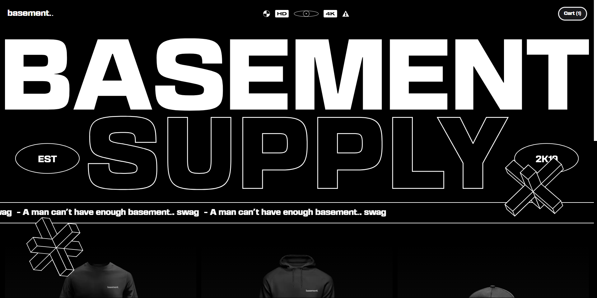
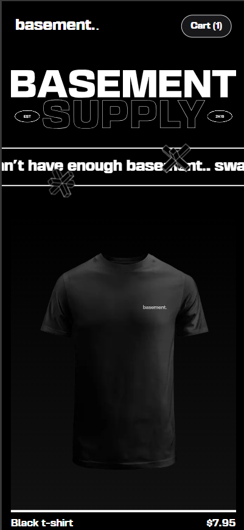
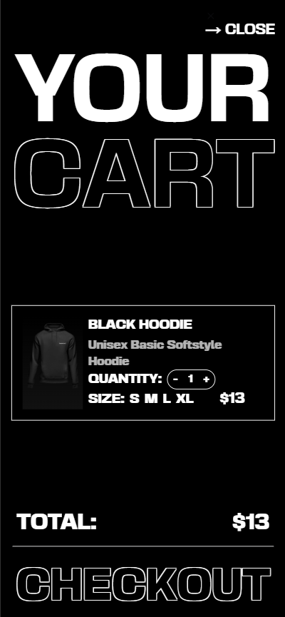

# How did i make this?

## Stack:
- NextJS
- GSAP
- Tailwind
- Shadcn-ui
- Zustand
- Sonner

## Process

With the Figma file it was quite easy to mockup the whole structure of the web, first i created all the components boilerplate to build the main scaffolding and then i started to implement the styles and features to each of them.
I coded manually the main texts of the header and the footer, but then i discovered that they were images at the Figma file hahaha.

| Basement Supply Main View Desktop | Basement Supply Main View Mobile |
|---|---|
|  |  |

Once i had all the styles well achieved, i started with the animations, the levitating shapes and the cart sheet were my favourites parts because of the GSAP's versatility and possibilities that provides.

The cart was pretty cool to build because i could use Shadcn to build the right animation in the most efficient way. And i used Zustand to manage the products, their quantity, and some variables views of the cart itself

## Conclusion
The correct implementation of Zustand and Shadcn allowed to build the whole project in just a few hours, keeping in mind that maybe there were many things that were achieved, polish was not compromised.
